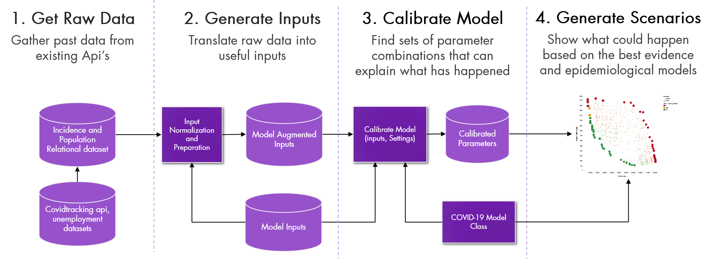

<!-- README.md is generated from README.Rmd. Please edit that file -->

<!-- badges: start -->

<!-- badges: end -->

# Reopening California: Seeking Robust, Non-Dominated COVID-19 Exit Strategies

This repository contains code associated with the paper *Reopening
California: Seeking Robust, Non-Dominated COVID-19 Exit Strategies*.
This paper will be first released as a working paper then submitted to a
journal.

R Package Developer: [Pedro Nascimento de
Lima](https://www.rand.org/about/people/l/lima_pedro_nascimento_de.html)

Model Developers: [Raffaele
Vardavas](https://www.rand.org/about/people/v/vardavas_raffaele.html),
[Pedro Nascimento de
Lima](https://www.rand.org/about/people/l/lima_pedro_nascimento_de.html)

Data Pipeline Developers: [Pedro Nascimento de
Lima](https://www.rand.org/about/people/l/lima_pedro_nascimento_de.html),
[Lawrence
Baker](https://www.rand.org/about/people/b/baker_lawrence.html)

### Related publications

  - Working Paper: [Reopening California: Seeking Robust, Non-Dominated
    COVID-19 Exit
    Strategies.](https://www.rand.org/pubs/working_papers/WRA1080-2.html)

  - Working Paper: [Modeling COVID-19 Nonpharmaceutical Interventions:
    Exploring periodic NPI
    strategies.](https://www.rand.org/pubs/working_papers/WRA1080-1.html)

  - Original Decision Support Tool: [The Health and Economic Impacts of
    Nonpharmaceutical Interventions to Address COVID-19: A Decision
    Support Tool for State and Local
    Policymakers](https://www.rand.org/pubs/tools/TLA173-1.html)

# Using this repository

Please use the .Rproject to work in this project with R Studio. When
necessary, all scripts assume that the working directory is the base
directory.

This repository uses [git lfs](https://git-lfs.github.com/). Make sure
to download all git lfs files before trying to run the model.

# The c19randepimod R package

We created the `c19randepimod` R package to be create a set of generic
functions that could be used across projects as our model evolved. The
package contains functions that are used with our `c19model` class or
with its lower-level classes. This allows us to create new model classes
that use the same set of the underlying functions. We used different
model classes for each of our publications, as we learned more about
COVID-19. For example, our original state policy tool did not include
vaccination, but the most recent model includes vaccination and a range
of other uncertainties.

## Overview

The figure below illustrates the main steps we take to run the model.
The R package starts by gathering data from the [covidtracking
api](https://covidtracking.com/data/api) and a spreadsheet containing
model inputs using the `get_augmented_inputs` function. This function
creates a model object that contains everything we need to calibrate the
model. Then, we use the `calibrate` or the recent `calibrate_imabc`
function to find parameters that can produce outcomes consistent with
observed time-series.

Finally, we can run the model after the calibration period by using the
functions `set_parameter` to set different types of paramters and use
the function `set_experimental_design` to define the future experimental
design. We then use the `evaluate_experiment` function to evaluate the
experimental design. The section below indicates how we perform these
steps for the *Reopening California* paper.

# Repository Structure:

This folder is organized as follows:

  - **./c19randepimod:** contains a snapshot of the c19randepimod R
    package code. We created this package to generalize functions that
    will be useful beyond this analysis. The package has been used for
    all the publications we list here, but this reposistory only
    contains code for the “Reopening California” paper.

  - **./00\_dependencies:** contains the dependencies necessary to run
    all analysis. Run the install\_dependencies.R file for the first
    time if needed. This will install the dependencies you need to run
    the model. Make sure you are using R \> 3.6.1.

  - **./01\_calibration:** contains scripts three R scripts. The first
    called 01\_calibration\_imabc.R sets up and runs the calibration by
    calling the function calibrate\_imabc. This function is contained in
    the file in the file calibrate\_imabc.R. The inputs folder contain
    the spreadsheets that are read in as inputs for the model.

  - **./02\_future\_runs:** contains three R scripts. The first called
    01\_setup\_experiments.R is a simple script that sets the
    experimental design, as specified in the setup\_rdm\_experiments.R
    file. This is where the future experimental design is defined. Then,
    we use the hpc\_run\_experiments to run the experiments defined
    previously in parallel. One can run this script manually as well,
    but we use the hpc\_run\_experiments.sbatch file contained in the
    root directory to run the model in HPC clusters using slurm’s array
    jobs. This allows us to run the model across several nodes.

  - **./03\_regret\_analysis:** contains the script
    03\_regret-analysis.R that calls functions in regret-functions.R.
    This is where the results are read, and this is where we analyse the
    regret from different policies. This script produces the plots we
    use in our papers and presentations.

  - **./04\_tableau\_plots:** contains a tableau workbook we use to
    generate plots and summary tables. I use the tableau workbook to
    generate the summary tables in the strategy\_summaryes.xlsx.

# Contact

For questions, reach out to Pedro at plima \[at\] rand dot org

# License

Copyright (C) 2021 by [The RAND Corporation](www.rand.org). This
repository is released as open source software under a GPL-2.0 license.
See the LICENSE file.
